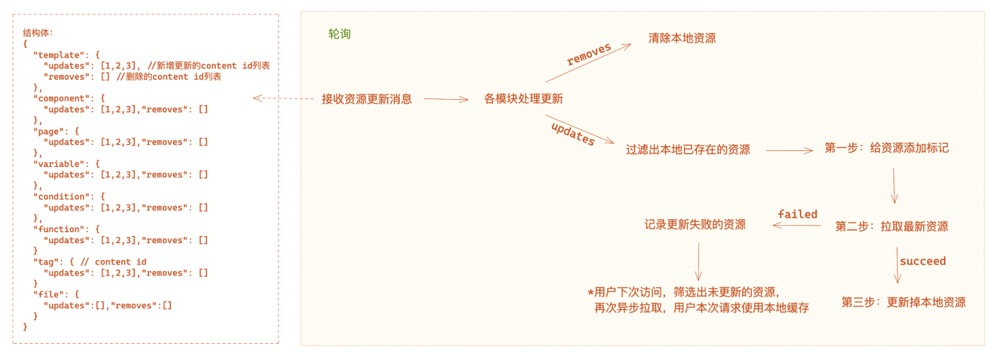

# Foxpage Node SDK Guides

`Foxpage Node SDK`是`Foxpage`的核心部分，包含点火（`Ignite`）、资源管理（`Manager`）、 DSL解析（`Parser`）、页面渲染（`Render`）等。

## 一、 点火 Ignite

点火阶段主要是针对各模块做初始化：
1. init configs
2. init manager
3. init parser
4. ...


> 1. 在点火`init manager`阶段，会以application维度分别去对一些必要依赖的资源（目前只有`package`）做初始化。
> 2. 只有所有模块初始化成功之后，点火才算成功。


## 二、 资源管理器 Manager
负责所有资源的管理，包含package，page，template，variable，condition，function，tag等。

> 1. 在点火`Ignite`阶段，会初始化好资源管理器
> 2. 所有资源以`application`维度来分开管理

### 初始化
1. 初始化各个模块的资源管理器
```ts
// init source managers
this.fileManager = new FileManagerImpl(this);
this.pageManager = new PageManagerImpl(this);
this.packageManager = new PackageManagerImpl(this);
this.templateManager = new TemplateManagerImpl(this);
this.variableManager = new VariableManagerImpl(this);
this.conditionManager = new ConditionManagerImpl(this);
this.functionManager = new FunctionManagerImpl(this);
this.pluginManager = new PluginManagerImpl(this);
this.tagManager = new TagManagerImpl(this);
```
2. 初始化调度器`schedule`（轮询去拉取最新修改，更新本地资源）
```ts
if (this.enableSchedule()) {
    // instance resource update scheduler
    this.schedule = createSourceUpdateSchedule(this);
    // listen schedule error
    this.schedule.on('ERROR', error => {
        this.logger.warn('schedule error:', error);
    });
}
```
3. 初始化数据更新`DATA_PUSH`监听事件（多进程间资源管理见： [数据更新](./data-update.md)）
```ts
this.pageManager.on('DATA_PUSH', (data: ContentInfo) => {
    this.emit('DATA_STASH', data);
});
```


### 准备
准备阶段主要是负责核心资源（`package`）的首次全量拉取和开启`schedule`，如下：
```ts
 public async prepare() {
    await this.packageManager.freshPackages();

    // start schedule
    if (this.enableSchedule()) {
      this.logger.debug('start process schedule');
      // 监听schedule响应
      this.onScheduled();
      this.schedule?.start();
    }
  }
```

### 运行中
在运行过程中有且仅有2个操作会更新本地资源：

1. 轮询拉取最新更新，更新机制如下：


2. 用户访问

当用户访问到的资源本地不存在时，会实时去服务端拉取，拉取成功之后缓存到本地。

## 三、 解析器 Parser

负责解析工作，主要包含`template`，`condition`，`variable`，`function`的解析。


> 在点火`Ignite`阶段，会初始化好解析器。

1. parse template

`template` 的使用是通过指令`directive.tpl`来实现的。

2. parse condition

`condition` 的使用是通过指令`directive.if`来实现的。

3. parse variable

4. parse function

## 四、 渲染器 Render
负责页面的渲染工作，目前支持`React`渲染。

经过`Parser`解析得到的`DSL Schemas`是一个完整的页面结构，
